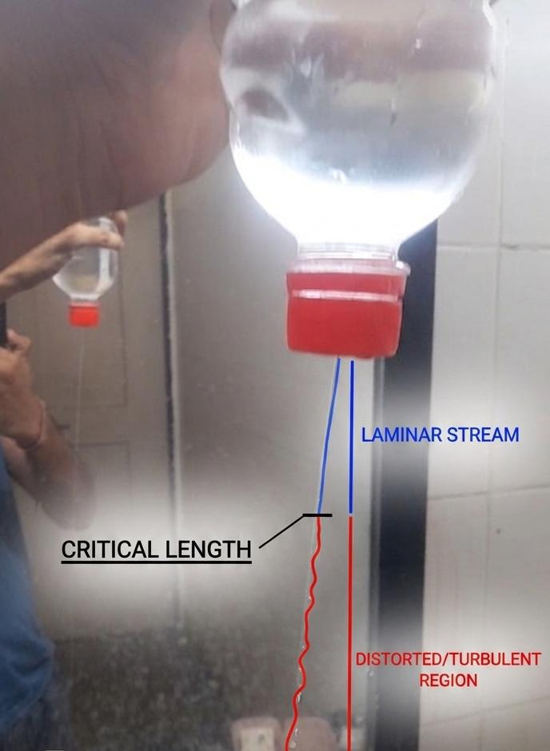
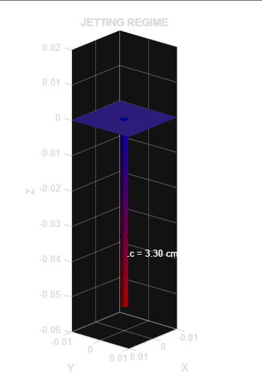
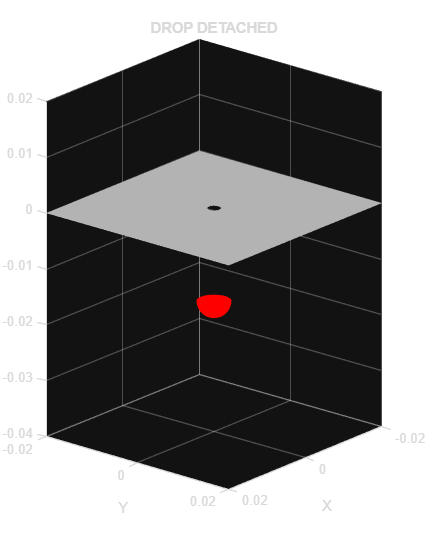

# REGIMES

# Motivation

While observing water droplets dripping from a ceiling at a nearly constant frequency, I became curious about the physical parameters governing droplet formation and dripping frequency.

To explore this, I performed a simple fluid mechanics experiment using a plastic bottle with a small hole of approximately 1 mm diameter. The bottle was filled with water and inverted vertically to observe the transition between dripping and jetting regimes.

During the experiment, I collected data related to:
- Water head height
- Droplet formation behavior!
- Jet breakup and critical length
- Transition between dripping and jetting regimes

An interesting observation was that at a water head of nearly 3 cm, the system transitioned into the dripping regime.

This curiosity-driven experiment motivated the development of a MATLAB-based simulation to model:
- Dripping and jetting behavior
- Surface tension and gravity force balance
- Weber-number-based regime prediction
- Critical breakup length estimation
- Relationship between head height and droplet formation time.
## Experimental Observation

# Physics Used

## Torricelli Velocity

v = sqrt(2gh)

---

## Weber Number

We = (rho*v^2*d)/sigma

---

## Critical Breakup Length

Lc = C*r*sqrt(We)

---

## Drop Formation Time

t = Vdrop/Q

---

# Features

- 3D MATLAB visualization
- Dripping and jetting simulation
- Surface tension based droplet detachment
- Breakup length estimation
- Head dependent droplet timing
- Fluid mechanics based modeling

---

# Applications

- Inkjet printing
- Fuel injectors
- Spray systems
- Microfluidics
- Fluid instability studies

---

# Author

Mayur Khode
Mechanical Engineering Student